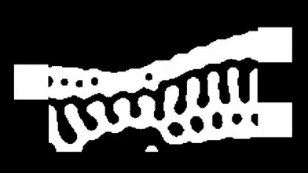

# DeepLitho v0.1
Pytorch implementation of deeplitho to convert GDS masks to post-lithography SEMs, emulating the effects of a DUV process.<br><br>


</img>

  

# Usage

It is recommended to use the colab environment to run deeplitho.


[![Open In Colab][colab-badge]][colab-notebook-deeplitho]

## Example design
Download the example circuit from the link below:
[example-design.gds][example-design]

## Prerequisites

- Linux or macOS

- Python 3

- NVIDIA GPU (11G memory or larger) + CUDA cuDNN

  

## Getting Started

### Installation

- Install PyTorch and dependencies from http://pytorch.org

- Install python libraries [dominate](https://github.com/Knio/dominate).

```bash

pip install dominate

```

- Clone this repo:

```bash

git clone https://github.com/jaspreetj/deeplitho_workshop_2022

cd deeplitho_workshop_2022

```

  
  

### Testing
- Please download the pre-trained model from [here](https://drive.google.com/file/d/1D1PAL2E3uZFnPXSVfCZAvCLuP70hgLPQ/view?usp=share_link) (google drive link), and run the following command
```bash
repo_name_code = "deeplitho_workshop_2022"
repo_name_model = "checkpoints"
unzip "checkpoints_gds_to_sem_bin.zip"
mv -v $repo_name_model $repo_name_code/
```

[colab-notebook-deeplitho]: <https://colab.research.google.com/drive/1-tWFvRGPAXDn0t9RgdHPUFw_qlFB642Y?usp=sharing>
[example-design]: <https://drive.google.com/file/d/1PqbzQEh4X6iYQ_89ZEAu7rj64dFS9kEz/view?usp=share_link>
[colab-badge]: <https://colab.research.google.com/assets/colab-badge.svg>
